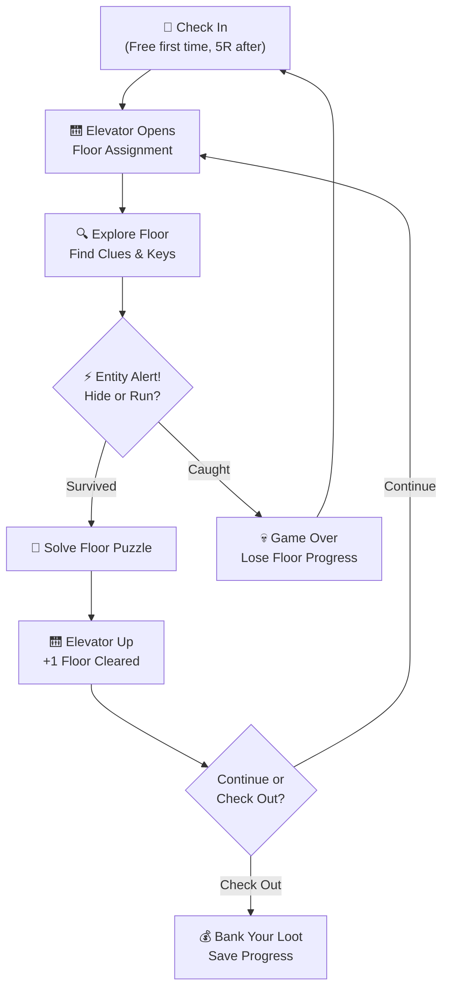
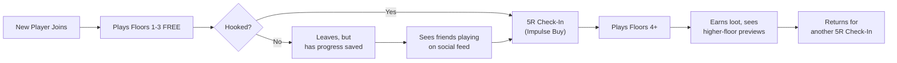
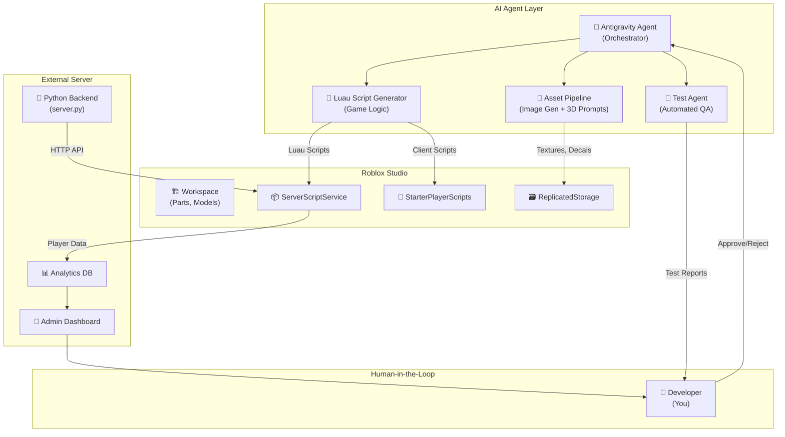
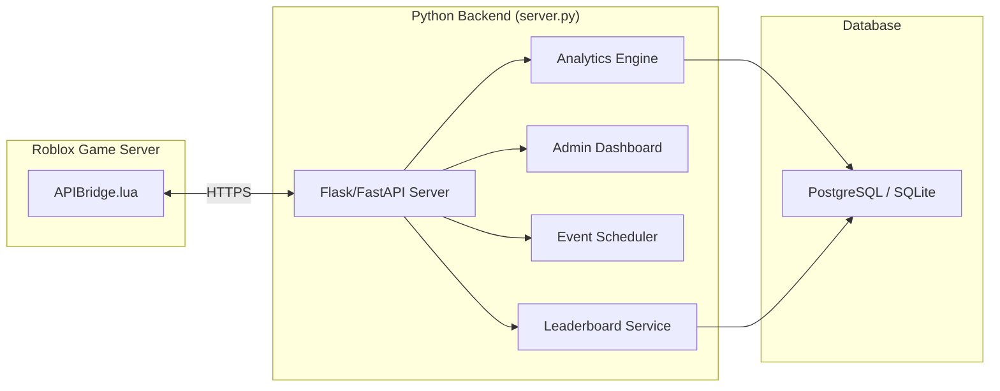

# 🏨 HOTEL HERMES — "You Can Check In, But You Can Never Check Out"


## The Elevator Pitch

**Hotel Hermes** is an infinitely-ascending haunted hotel survival game where players wake up trapped in a mysterious, ever-shifting hotel. Each **floor** is a procedurally-assembled horror puzzle — solve it to take the elevator up, or get caught by the floor's **Entity** and lose everything. The deeper you go, the weirder and more terrifying the hotel becomes.

> [!IMPORTANT]
> **The Hook**: Floor 1-3 are **FREE**. After that, each "Check-In" (game session) costs **5 Robux** — framed as your character "paying the front desk" to stay another night. This is dirt cheap, feels diegetic (in-universe), and creates a natural "one more run" impulse buy cycle.

---

## 🎮 Core Game Loop



### The Risk-Reward Tension

This is what makes it **addictive**:
- **You can "Check Out" (save) at any elevator stop** and bank your earned cosmetics, currency, and floor progress
- **But if you push for one more floor and die, you lose all unsaved loot from that run**
- This creates the classic "one more floor" dopamine loop — the same psychology that makes roguelikes irresistible

---

## 🏗️ Game Structure — The Floors

### Floor Categories

| Floor Range | Theme | Difficulty | Entity Type | Vibe |
|---|---|---|---|---|
| **1–3** (FREE) | Classic Haunted Hotel | Tutorial/Easy | The Bellhop (slow, predictable) | Creaky halls, flickering lights |
| **4–10** | Abandoned Wing | Medium | The Maid (patrols rooms, listens) | Dusty, broken furniture, whispers |
| **11–20** | Submerged Basement | Hard | The Drowned Guest (fast in water) | Flooded corridors, rusted pipes |
| **21–35** | Mirror Dimension | Expert | The Reflection (copies your moves) | Inverted rooms, impossible geometry |
| **36–50** | The Penthouse | Nightmare | The Manager (adaptive AI) | Luxury decor bleeding into void |
| **50+** | The Infinite Attic | Endless | ALL entities, randomized | Procedural chaos, prestige zone |

### Each Floor Contains:
1. **3-5 Rooms** to explore (randomized layout from room pool)
2. **1 Puzzle** to solve (keycard hunt, safe code, ritual, electrical repair, etc.)
3. **1 Entity** actively hunting the player
4. **Hidden Loot** — cosmetics, hotel coins, lore fragments
5. **Optional Side Room** — high risk, high reward secret rooms

---

## 💀 The Entities (Monsters)

Each entity has **unique AI behavior** — this is crucial for replayability:

### 🔔 The Bellhop (Floors 1-3, FREE)
- **Behavior**: Walks a fixed patrol route. Rings a bell before entering rooms (audio cue).
- **Counter**: Hide in wardrobes/under beds when you hear the bell.
- **Teaching**: Introduces core stealth mechanic gently.

### 🧹 The Maid (Floors 4-10)
- **Behavior**: Responds to **noise**. Running, opening doors loudly, or bumping furniture alerts her.
- **Counter**: Crouch-walk, open doors slowly, use distraction items (throw bottles).
- **Escalation**: Gets faster the more noise you've made on the floor.

### 🌊 The Drowned Guest (Floors 11-20)
- **Behavior**: Moves 3x speed through flooded sections. Stands still in dry areas.
- **Counter**: Plan routes through dry corridors. Use pumps to drain rooms temporarily.
- **Twist**: Some puzzle steps require entering flooded zones.

### 🪞 The Reflection (Floors 21-35)
- **Behavior**: **Mirrors your movement** in reverse. If you go left, it goes right toward you.
- **Counter**: Use the mirror geometry to predict its path. Certain mirrors can be shattered to "break" it temporarily.
- **Mind game**: Forces strategic movement planning.

### 🎩 The Manager (Floors 36-50)
- **Behavior**: **Learns from your play patterns**. If you always hide in wardrobes, it checks there first. If you always run, it cuts off routes.
- **Counter**: Vary your strategy. Use rare "Do Not Disturb" signs (consumable) to lock rooms.
- **The Boss**: The ultimate skill check.

---

## 💰 Monetization — The "Front Desk" System

> [!TIP]
> The monetization is designed to feel **fair and in-universe**. Players never feel "paywalled" — they feel like they're paying the hotel for another stay.

### Core Model

| Item | Price | Type | Notes |
|---|---|---|---|
| **First Check-In** | FREE | One-time | Full access to Floors 1-3 |
| **Standard Check-In** | 5 Robux | Per session | Access all unlocked floors |
| **VIP Room Key** | 10 Robux | Game Pass | Exclusive cosmetic room to decorate |
| **Night Shift Pass** | 25 Robux | Game Pass | Play as an Entity in PvP mode |
| **Concierge Badge** | 50 Robux | Game Pass | Early access to new floor packs |
| **Hotel Coin Packs** | 5-25 Robux | Consumable | Skip cosmetic grinding (NOT pay-to-win) |

### In-Game Currency: Hotel Coins 🪙
- Earned by clearing floors, finding secrets, and completing daily challenges
- Spent on: cosmetic skins, room decorations, emotes, flashlight skins
- **Cannot** buy gameplay advantages — strictly cosmetic

### The "Free Trial" Flow


---

## 🔄 Retention Mechanics — Why Players Come Back

### 1. Daily Check-In Rewards (Free)
Even without paying, players can log in daily and spin a **Room Service Wheel** for free Hotel Coins, cosmetics, and temporary boosts. This keeps them engaged and eventually converts them.

### 2. Floor Leaderboards
Global leaderboard for highest floor reached. Seasonal resets with exclusive trophies. Players WILL grind for that #1 spot.

### 3. Lore Fragments
Each floor has hidden lore notes revealing the dark history of Hotel Hermes. Collecting all fragments on a floor unlocks a **Lore Badge** — this appeals to completionists and creates YouTube/TikTok content.

### 4. Weekly "Cursed Floor" Events
Every week, a special event floor appears with unique mechanics, limited-time cosmetics, and a special entity. Creates FOMO and recurring engagement.

### 5. Social Features
- **Co-op Mode**: Team up with 2-4 friends to tackle floors together (only host pays Check-In fee)
- **Ghost Mode**: Dead players become invisible ghosts who can watch and react (emotes) — keeps eliminated players engaged
- **Entity PvP**: Players with the Night Shift Pass can play AS the entities hunting other players

### 6. Room Customization
Players get a personal hotel room they can decorate with earned/bought items. This is their persistent "home base" that friends can visit. Decoration meta creates its own engagement loop.

---

## 🛠️ AI-Assisted Development Pipeline

> [!IMPORTANT]
> This section defines how AI agents + human oversight work together throughout the entire development lifecycle.

### Architecture Overview



### Development Phases

#### Phase 1: Foundation (Weeks 1-2)
| Task | AI Role | Human Role |
|---|---|---|
| Map layout system | Generate modular room templates in Luau | Review room feel, adjust proportions in Studio |
| Player controller | Write movement, crouch, interact scripts | Playtest feel, tune speed/sensitivity |
| Lighting system | Generate atmospheric lighting configs | Art-direct the mood, approve color palette |
| UI framework | Build HUD, menus, inventory UI | Approve UX flow, visual style |

#### Phase 2: Entities & AI (Weeks 3-4)
| Task | AI Role | Human Role |
|---|---|---|
| Pathfinding system | Implement A* / NavMesh navigation | Test in actual maps, tune waypoints |
| Entity behaviors | Code each entity's unique AI state machine | Playtest for fairness, scary-factor, fun |
| Audio system | Set up spatial audio, footstep detection | Source/approve horror SFX and ambient tracks |
| Jump scare system | Code trigger zones and camera effects | Calibrate intensity (not too scary for young players) |

#### Phase 3: Monetization & Backend (Weeks 5-6)
| Task | AI Role | Human Role |
|---|---|---|
| Game Pass integration | Write MarketplaceService purchase flows | Verify Robux pricing, test purchase flow |
| DataStore system | Build save/load with ProfileService pattern | Define data schema, test data integrity |
| External API (server.py) | Build analytics endpoints, admin tools | Monitor dashboards, configure alerts |
| Anti-exploit | Implement server-side validation | Review security vectors, penetration test |

#### Phase 4: Content & Polish (Weeks 7-8)
| Task | AI Role | Human Role |
|---|---|---|
| Procedural floor generation | Algorithm for room arrangement + difficulty | Playtest generated floors for quality |
| Cosmetics system | Build inventory, equip, and showcase UI | Curate cosmetic catalog, approve art |
| Social features | Implement co-op, ghost mode, leaderboards | Test multiplayer, balance team mechanics |
| Onboarding | Build tutorial sequence for Floors 1-3 | UX review, ensure new players understand |

---

## 📁 Roblox Studio Project Structure

```
Hotel_Hermes/
├── Workspace/
│   ├── Lobby/                    # Check-in desk, room service wheel, leaderboards
│   ├── Elevator/                 # The central transition piece between floors
│   ├── FloorTemplates/           # Modular room pieces (assembled procedurally)
│   │   ├── Hallways/
│   │   ├── GuestRooms/
│   │   ├── Bathrooms/
│   │   ├── Kitchens/
│   │   └── SecretRooms/
│   └── PlayerRooms/              # Personal customizable rooms
│
├── ServerScriptService/
│   ├── GameManager.lua           # Core game state machine
│   ├── FloorGenerator.lua        # Procedural floor assembly
│   ├── EntityAI/
│   │   ├── Bellhop.lua
│   │   ├── Maid.lua
│   │   ├── DrownedGuest.lua
│   │   ├── Reflection.lua
│   │   └── Manager.lua
│   ├── DataManager.lua           # Player save/load (ProfileService)
│   ├── MonetizationManager.lua   # Game Passes, Check-In purchases
│   ├── AntiExploit.lua           # Server-side validation
│   └── APIBridge.lua             # HTTP calls to external server.py
│
├── StarterPlayerScripts/
│   ├── PlayerController.lua      # Movement, crouch, interact
│   ├── CameraEffects.lua         # Horror camera shakes, zoom, blur
│   ├── AudioManager.lua          # Spatial audio, ambient, SFX
│   └── UIController.lua          # HUD updates, notifications
│
├── StarterGui/
│   ├── HUD/                      # Health, inventory, floor counter
│   ├── MainMenu/                 # Check-in screen, settings
│   ├── PuzzleUI/                 # Keypad, safe combo, ritual UI
│   └── Shop/                     # Cosmetics store, game passes
│
├── ReplicatedStorage/
│   ├── SharedModules/
│   │   ├── PuzzleDefinitions.lua # All puzzle templates
│   │   ├── LoreData.lua          # Floor lore text and unlock conditions
│   │   ├── CosmeticsCatalog.lua  # All cosmetic item definitions
│   │   └── Constants.lua         # Game-wide constants
│   ├── Remotes/                  # RemoteEvents & RemoteFunctions
│   └── Assets/                   # Textures, decals, particles
│
└── ServerStorage/
    ├── FloorPrefabs/             # Pre-built room models
    ├── EntityModels/             # Monster rigs and animations
    └── ToolModels/               # Flashlight, keys, bottles
```

---

## 🔗 External Server Integration (server.py)

Your existing `server.py` will serve as the backend for:



### API Endpoints Needed

| Endpoint | Method | Purpose |
|---|---|---|
| `/api/player/checkin` | POST | Log check-in event, validate session |
| `/api/player/stats` | GET | Fetch player stats for dashboard |
| `/api/leaderboard/global` | GET | Get top players by floor reached |
| `/api/events/current` | GET | Get active weekly cursed floor config |
| `/api/analytics/session` | POST | Log session data (duration, floor, death cause) |
| `/api/admin/event/create` | POST | Admin creates new weekly event |

---

## 📊 Revenue Projection

Assuming modest traction:

| Metric | Conservative | Optimistic |
|---|---|---|
| Monthly Active Players | 5,000 | 50,000 |
| Avg. Check-Ins per Player/Month | 8 | 15 |
| Check-In Revenue (5R each) | 200,000 R/mo | 3,750,000 R/mo |
| Game Pass Conversion (5%) | 250-1250 passes | 2,500-12,500 passes |
| **Monthly Robux Revenue** | ~300,000 R | ~5,000,000 R |
| **Monthly USD (at 0.0035/R)** | ~$1,050 | ~$17,500 |

> [!NOTE]
> These are rough estimates. The key insight is that the **5 Robux micro-transaction model scales beautifully** because it's below the psychological resistance threshold — players treat it like pocket change, similar to arcade tokens.

---

## 🎯 What Makes This Concept Addictive

1. **Roguelike "One More Run"** — The risk of losing loot creates tension; the reward of banking it creates relief. This emotional cycle is the core addiction loop.

2. **Procedural Variety** — No two runs feel identical. Random room layouts + entity spawn patterns + puzzle combinations = high replayability.

3. **Social Pressure** — Leaderboards, co-op, and "my friend reached Floor 30" creates FOMO-driven engagement.

4. **Content Drip** — New floor themes, entities, and weekly events keep the game fresh month after month.

5. **Low Entry Barrier** — Free first 3 floors is enough to get hooked. 5 Robux is cheap enough that even young players can afford frequent sessions.

6. **YouTube/TikTok Bait** — Horror + moments of tension + funny death reactions = organic content creation and free marketing.

---

## ✅ Next Steps

Once you approve this concept, here's the execution order:

1. **Set up Roblox Studio project** with the folder structure above
2. **Build the lobby** — Check-in desk, elevator, atmosphere
3. **Create the player controller** — Movement, crouch, interact, flashlight
4. **Build 3 tutorial floor rooms** — The free content that hooks players
5. **Implement The Bellhop entity AI** — First monster encounter
6. **Wire up the monetization** — Check-In purchase flow via MarketplaceService
7. **Connect server.py** — Analytics and leaderboard backend
8. **Playtest & iterate** — The human-in-the-loop polish phase

> [!TIP]
> All Luau scripts, UI layouts, and game logic can be generated by the AI agent. You review, tweak in Roblox Studio, and playtest. This is the **AI agent + human-in-the-loop** workflow — AI handles the code volume, you handle the creative judgment and quality bar.
