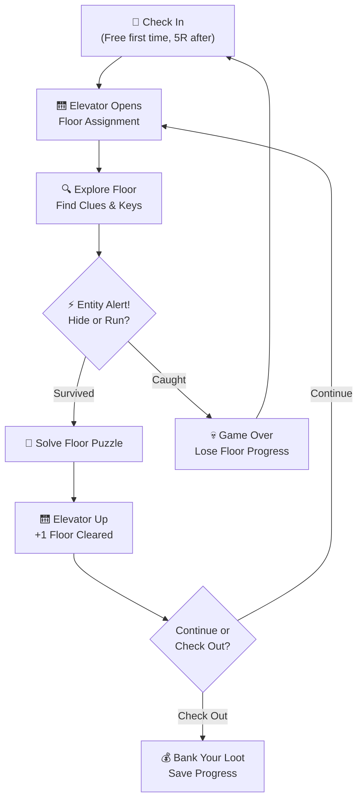
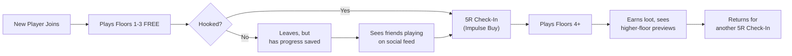
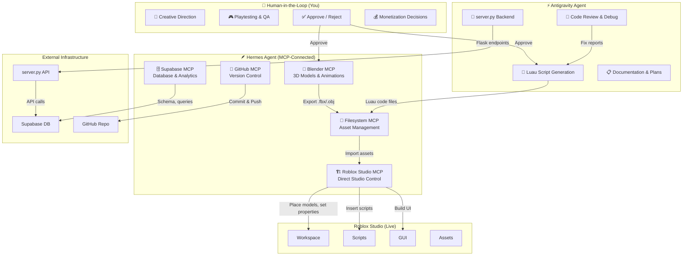
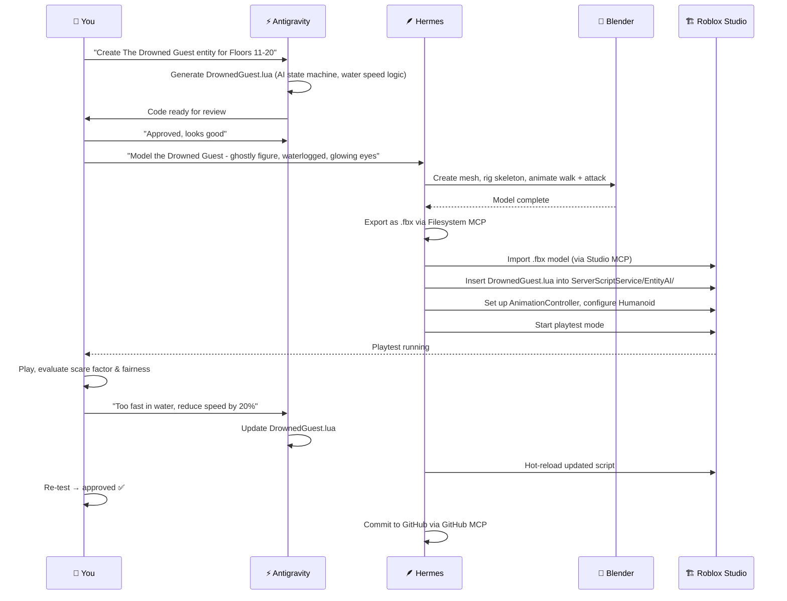
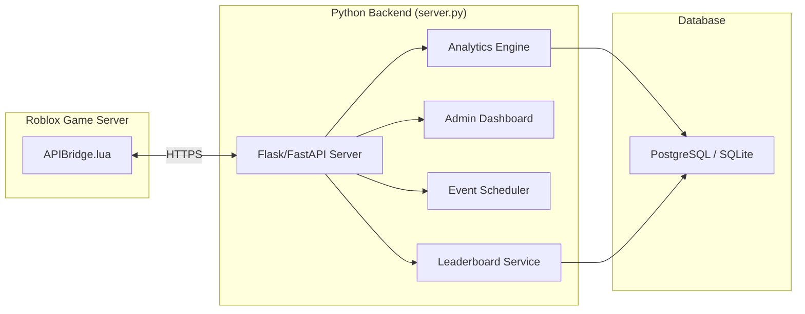

# 🏨 HOTEL HERMES — "You Can Check In, But You Can Never Check Out"


## The Elevator Pitch

**Hotel Hermes** is an infinitely-ascending haunted hotel survival game where players wake up trapped in a mysterious, ever-shifting hotel. Each **floor** is a procedurally-assembled horror puzzle — solve it to take the elevator up, or get caught by the floor's **Entity** and lose everything. The deeper you go, the weirder and more terrifying the hotel becomes.

> [!IMPORTANT]
> **The Hook**: Floor 1-3 are **FREE**. After that, each "Check-In" (game session) costs **5 Robux** — framed as your character "paying the front desk" to stay another night. This is dirt cheap, feels diegetic (in-universe), and creates a natural "one more run" impulse buy cycle.

---

## 🎮 Core Game Loop



### The Risk-Reward Tension

This is what makes it **addictive**:
- **You can "Check Out" (save) at any elevator stop** and bank your earned cosmetics, currency, and floor progress
- **But if you push for one more floor and die, you lose all unsaved loot from that run**
- This creates the classic "one more floor" dopamine loop — the same psychology that makes roguelikes irresistible

---

## 🏗️ Game Structure — The Floors

### Floor Categories

| Floor Range | Theme | Difficulty | Entity Type | Vibe |
|---|---|---|---|---|
| **1–3** (FREE) | Classic Haunted Hotel | Tutorial/Easy | The Bellhop (slow, predictable) | Creaky halls, flickering lights |
| **4–10** | Abandoned Wing | Medium | The Maid (patrols rooms, listens) | Dusty, broken furniture, whispers |
| **11–20** | Submerged Basement | Hard | The Drowned Guest (fast in water) | Flooded corridors, rusted pipes |
| **21–35** | Mirror Dimension | Expert | The Reflection (copies your moves) | Inverted rooms, impossible geometry |
| **36–50** | The Penthouse | Nightmare | The Manager (adaptive AI) | Luxury decor bleeding into void |
| **50+** | The Infinite Attic | Endless | ALL entities, randomized | Procedural chaos, prestige zone |

### Each Floor Contains:
1. **3-5 Rooms** to explore (randomized layout from room pool)
2. **1 Puzzle** to solve (keycard hunt, safe code, ritual, electrical repair, etc.)
3. **1 Entity** actively hunting the player
4. **Hidden Loot** — cosmetics, hotel coins, lore fragments
5. **Optional Side Room** — high risk, high reward secret rooms

---

## 💀 The Entities (Monsters)

Each entity has **unique AI behavior** — this is crucial for replayability:

### 🔔 The Bellhop (Floors 1-3, FREE)
- **Behavior**: Walks a fixed patrol route. Rings a bell before entering rooms (audio cue).
- **Counter**: Hide in wardrobes/under beds when you hear the bell.
- **Teaching**: Introduces core stealth mechanic gently.

### 🧹 The Maid (Floors 4-10)
- **Behavior**: Responds to **noise**. Running, opening doors loudly, or bumping furniture alerts her.
- **Counter**: Crouch-walk, open doors slowly, use distraction items (throw bottles).
- **Escalation**: Gets faster the more noise you've made on the floor.

### 🌊 The Drowned Guest (Floors 11-20)
- **Behavior**: Moves 3x speed through flooded sections. Stands still in dry areas.
- **Counter**: Plan routes through dry corridors. Use pumps to drain rooms temporarily.
- **Twist**: Some puzzle steps require entering flooded zones.

### 🪞 The Reflection (Floors 21-35)
- **Behavior**: **Mirrors your movement** in reverse. If you go left, it goes right toward you.
- **Counter**: Use the mirror geometry to predict its path. Certain mirrors can be shattered to "break" it temporarily.
- **Mind game**: Forces strategic movement planning.

### 🎩 The Manager (Floors 36-50)
- **Behavior**: **Learns from your play patterns**. If you always hide in wardrobes, it checks there first. If you always run, it cuts off routes.
- **Counter**: Vary your strategy. Use rare "Do Not Disturb" signs (consumable) to lock rooms.
- **The Boss**: The ultimate skill check.

---

## 💰 Monetization — The "Front Desk" System

> [!TIP]
> The monetization is designed to feel **fair and in-universe**. Players never feel "paywalled" — they feel like they're paying the hotel for another stay.

### Core Model

| Item | Price | Type | Notes |
|---|---|---|---|
| **First Check-In** | FREE | One-time | Full access to Floors 1-3 |
| **Standard Check-In** | 5 Robux | Per session | Access all unlocked floors |
| **VIP Room Key** | 10 Robux | Game Pass | Exclusive cosmetic room to decorate |
| **Night Shift Pass** | 25 Robux | Game Pass | Play as an Entity in PvP mode |
| **Concierge Badge** | 50 Robux | Game Pass | Early access to new floor packs |
| **Hotel Coin Packs** | 5-25 Robux | Consumable | Skip cosmetic grinding (NOT pay-to-win) |

### In-Game Currency: Hotel Coins 🪙
- Earned by clearing floors, finding secrets, and completing daily challenges
- Spent on: cosmetic skins, room decorations, emotes, flashlight skins
- **Cannot** buy gameplay advantages — strictly cosmetic

### The "Free Trial" Flow


---

## 🔄 Retention Mechanics — Why Players Come Back

### 1. Daily Check-In Rewards (Free)
Even without paying, players can log in daily and spin a **Room Service Wheel** for free Hotel Coins, cosmetics, and temporary boosts. This keeps them engaged and eventually converts them.

### 2. Floor Leaderboards
Global leaderboard for highest floor reached. Seasonal resets with exclusive trophies. Players WILL grind for that #1 spot.

### 3. Lore Fragments
Each floor has hidden lore notes revealing the dark history of Hotel Hermes. Collecting all fragments on a floor unlocks a **Lore Badge** — this appeals to completionists and creates YouTube/TikTok content.

### 4. Weekly "Cursed Floor" Events
Every week, a special event floor appears with unique mechanics, limited-time cosmetics, and a special entity. Creates FOMO and recurring engagement.

### 5. Social Features
- **Co-op Mode**: Team up with 2-4 friends to tackle floors together (only host pays Check-In fee)
- **Ghost Mode**: Dead players become invisible ghosts who can watch and react (emotes) — keeps eliminated players engaged
- **Entity PvP**: Players with the Night Shift Pass can play AS the entities hunting other players

### 6. Room Customization
Players get a personal hotel room they can decorate with earned/bought items. This is their persistent "home base" that friends can visit. Decoration meta creates its own engagement loop.

---

## 🛠️ Multi-Agent Development Pipeline

> [!IMPORTANT]
> The game is built by **two AI agents + you**. The workload is distributed so no single agent is overloaded. **Hermes Agent** (your existing agent with MCP connections) handles 3D assets, direct Roblox Studio manipulation, and database work. **Antigravity** handles code generation, backend logic, documentation, and orchestration. **You** are the creative director, playtester, and final approver.

### Agent Ownership Map



### The 5 MCPs Hermes Needs

| # | MCP Server | What It Does for Hotel Hermes | Setup |
|---|---|---|---|
| 1 | **🧊 Blender MCP** ✅ (already connected) | Model entity rigs (Bellhop, Maid, etc.), room furniture, props, flashlight, elevator. Export as `.fbx` for Roblox import. Generate animations (walk cycles, attack poses, idle). | `blender-mcp` by ahujasid |
| 2 | **🏗️ Roblox Studio MCP** ⭐ (critical, add this) | Directly manipulate Roblox Studio — place parts, insert scripts, modify properties, set lighting, start/stop playtests, read console logs. This is the bridge that lets Hermes *act inside Studio* without you manually copy-pasting. | Built-in to Roblox Studio (2026). Enable via Assistant widget → Manage MCP Servers |
| 3 | **🗄️ Supabase MCP** (recommended) | Manage the analytics database — create tables, run queries, set up Row Level Security. Hermes can build the entire leaderboard, player stats, and event scheduler DB schema via natural language. | `npx -y @supabase/mcp-server-supabase@latest --access-token <token>` |
| 4 | **📂 Filesystem MCP** (recommended) | Read/write local project files — manage exported Blender assets, organize texture files, handle the asset pipeline between Blender → local disk → Roblox Studio. | `@modelcontextprotocol/server-filesystem` (official) |
| 5 | **🔀 GitHub MCP** (recommended) | Version control for all Luau scripts and server.py code. Hermes can commit, push, create branches, and manage PRs. Critical for rollback safety on a live game. | `@modelcontextprotocol/server-github` (official) |

> [!TIP]
> **Why Roblox Studio MCP is the game-changer**: Without it, the workflow is: AI generates code → you copy-paste into Studio → you manually position parts. With it, Hermes can directly: create Parts, set CFrame positions, insert Scripts, modify Lighting properties, clone templates, and even run playtests — all through natural language commands.

### Agent Responsibility Split

| Domain | Hermes Agent 🪶 | Antigravity ⚡ | You 👤 |
|---|---|---|---|
| **3D Models** | ✅ Model in Blender, export .fbx | — | Approve look & feel |
| **Roblox Studio manipulation** | ✅ Place parts, set lighting, build rooms via Studio MCP | — | Playtest in Studio |
| **Luau game scripts** | ✅ Insert into Studio via MCP | ✅ Generate the code | Review logic, approve |
| **Entity AI behavior** | ✅ Test in Studio playtest mode | ✅ Write state machine code | Tune difficulty, fun factor |
| **UI/GUI** | ✅ Build ScreenGuis in Studio | ✅ Generate UI layout code | Approve UX design |
| **server.py backend** | — | ✅ Full ownership | Monitor dashboards |
| **Database (Supabase)** | ✅ Schema, tables, queries via Supabase MCP | ✅ API integration code | Approve data model |
| **Textures & decals** | ✅ Render in Blender / export | ✅ Generate 2D art via image gen | Approve art style |
| **Version control** | ✅ Commit/push via GitHub MCP | ✅ Track changes in artifacts | Review PRs, merge |
| **Documentation** | — | ✅ Full ownership | Review |
| **Monetization logic** | ✅ Wire up in Studio | ✅ Write MarketplaceService code | Set pricing, approve flow |
| **Audio & SFX** | ✅ Import audio files into Studio | — | Source/select audio assets |
| **Playtesting** | ✅ Start/stop playtest via Studio MCP | — | ✅ Play and evaluate |

### Hermes MCP Configuration

Add these to your Hermes agent's MCP config (e.g., `mcp_config.json`):

```json
{
  "mcpServers": {
    "blender": {
      "command": "npx",
      "args": ["-y", "blender-mcp"]
    },
    "roblox-studio": {
      "note": "Built-in to Roblox Studio 2026. Enable via Assistant > Manage MCP Servers. Copy the JSON snippet Studio provides and paste here."
    },
    "supabase": {
      "command": "npx",
      "args": ["-y", "@supabase/mcp-server-supabase@latest", "--access-token", "YOUR_SUPABASE_ACCESS_TOKEN"]
    },
    "filesystem": {
      "command": "npx",
      "args": ["-y", "@modelcontextprotocol/server-filesystem", "C:/Users/abish/OneDrive/Desktop/roblox game hermes"]
    },
    "github": {
      "command": "npx",
      "args": ["-y", "@modelcontextprotocol/server-github"],
      "env": {
        "GITHUB_PERSONAL_ACCESS_TOKEN": "YOUR_GITHUB_PAT"
      }
    }
  }
}
```

### Development Phases (Multi-Agent)

#### Phase 1: Foundation (Weeks 1-2)
| Task | Hermes 🪶 | Antigravity ⚡ | You 👤 |
|---|---|---|---|
| Room 3D models | Model walls, doors, furniture in Blender → export .fbx | — | Approve models |
| Map layout system | Import models into Studio via MCP, arrange rooms | Generate FloorGenerator.lua (room assembly logic) | Review room feel in Studio |
| Player controller | Insert script into Studio | Write PlayerController.lua (movement, crouch, interact) | Playtest feel, tune speed |
| Lighting & atmosphere | Set Lighting properties via Studio MCP (fog, ambient, shadows) | Generate lighting config values | Art-direct the mood |
| UI framework | Build ScreenGuis in Studio via MCP | Write UIController.lua (HUD logic) | Approve UX flow |

#### Phase 2: Entities & AI (Weeks 3-4)
| Task | Hermes 🪶 | Antigravity ⚡ | You 👤 |
|---|---|---|---|
| Entity 3D rigs | Model Bellhop, Maid, etc. in Blender with animation | — | Approve creature designs |
| Entity import | Import rigs into Studio, set up Humanoid/AnimationController | Write entity AI state machines (Bellhop.lua, Maid.lua, etc.) | Playtest for fairness, scare factor |
| Pathfinding | Configure NavMesh in Studio | Implement A* / pathfinding logic | Test in actual maps |
| Audio system | Import SFX files into Studio | Write AudioManager.lua (spatial audio, triggers) | Source/approve horror SFX |
| Jump scares | Set up trigger parts in Studio | Write camera shake, blur, zoom effects | Calibrate intensity |

#### Phase 3: Monetization & Backend (Weeks 5-6)
| Task | Hermes 🪶 | Antigravity ⚡ | You 👤 |
|---|---|---|---|
| Game Pass setup | Configure passes in Studio / Creator Dashboard | Write MarketplaceService purchase flows | Set Robux pricing |
| DataStore system | — | Build save/load with ProfileService pattern | Test data integrity |
| Database schema | Create Supabase tables via MCP (players, sessions, leaderboards, events) | Write server.py API endpoints connecting to Supabase | Approve data model |
| Admin dashboard | — | Build Flask admin panel | Monitor dashboards |
| Anti-exploit | — | Implement server-side validation | Review security |

#### Phase 4: Content & Polish (Weeks 7-8)
| Task | Hermes 🪶 | Antigravity ⚡ | You 👤 |
|---|---|---|---|
| More floor content | Model new room variants, props, secret rooms in Blender | Algorithm for procedural floor arrangement | Playtest generated floors |
| Cosmetics | Model cosmetic items (flashlight skins, hats, room decor) | Build inventory, equip, showcase UI code | Curate catalog |
| Social features | Wire up co-op teleport in Studio | Implement co-op, ghost mode, leaderboard logic | Test multiplayer |
| Onboarding | Build tutorial trigger zones in Studio | Write tutorial sequence scripts | UX review |
| Version control | Commit all assets & scripts to GitHub via MCP | — | Review PRs, tag release |

### Workflow Example: Building a New Entity

Here's how the three-party workflow looks for a single feature:



---

## 📁 Roblox Studio Project Structure

```
Hotel_Hermes/
├── Workspace/
│   ├── Lobby/                    # Check-in desk, room service wheel, leaderboards
│   ├── Elevator/                 # The central transition piece between floors
│   ├── FloorTemplates/           # Modular room pieces (assembled procedurally)
│   │   ├── Hallways/
│   │   ├── GuestRooms/
│   │   ├── Bathrooms/
│   │   ├── Kitchens/
│   │   └── SecretRooms/
│   └── PlayerRooms/              # Personal customizable rooms
│
├── ServerScriptService/
│   ├── GameManager.lua           # Core game state machine
│   ├── FloorGenerator.lua        # Procedural floor assembly
│   ├── EntityAI/
│   │   ├── Bellhop.lua
│   │   ├── Maid.lua
│   │   ├── DrownedGuest.lua
│   │   ├── Reflection.lua
│   │   └── Manager.lua
│   ├── DataManager.lua           # Player save/load (ProfileService)
│   ├── MonetizationManager.lua   # Game Passes, Check-In purchases
│   ├── AntiExploit.lua           # Server-side validation
│   └── APIBridge.lua             # HTTP calls to external server.py
│
├── StarterPlayerScripts/
│   ├── PlayerController.lua      # Movement, crouch, interact
│   ├── CameraEffects.lua         # Horror camera shakes, zoom, blur
│   ├── AudioManager.lua          # Spatial audio, ambient, SFX
│   └── UIController.lua          # HUD updates, notifications
│
├── StarterGui/
│   ├── HUD/                      # Health, inventory, floor counter
│   ├── MainMenu/                 # Check-in screen, settings
│   ├── PuzzleUI/                 # Keypad, safe combo, ritual UI
│   └── Shop/                     # Cosmetics store, game passes
│
├── ReplicatedStorage/
│   ├── SharedModules/
│   │   ├── PuzzleDefinitions.lua # All puzzle templates
│   │   ├── LoreData.lua          # Floor lore text and unlock conditions
│   │   ├── CosmeticsCatalog.lua  # All cosmetic item definitions
│   │   └── Constants.lua         # Game-wide constants
│   ├── Remotes/                  # RemoteEvents & RemoteFunctions
│   └── Assets/                   # Textures, decals, particles
│
└── ServerStorage/
    ├── FloorPrefabs/             # Pre-built room models
    ├── EntityModels/             # Monster rigs and animations
    └── ToolModels/               # Flashlight, keys, bottles
```

---

## 🔗 External Server Integration (server.py)

Your existing `server.py` will serve as the backend for:



### API Endpoints Needed

| Endpoint | Method | Purpose |
|---|---|---|
| `/api/player/checkin` | POST | Log check-in event, validate session |
| `/api/player/stats` | GET | Fetch player stats for dashboard |
| `/api/leaderboard/global` | GET | Get top players by floor reached |
| `/api/events/current` | GET | Get active weekly cursed floor config |
| `/api/analytics/session` | POST | Log session data (duration, floor, death cause) |
| `/api/admin/event/create` | POST | Admin creates new weekly event |

---

## 📊 Revenue Projection

Assuming modest traction:

| Metric | Conservative | Optimistic |
|---|---|---|
| Monthly Active Players | 5,000 | 50,000 |
| Avg. Check-Ins per Player/Month | 8 | 15 |
| Check-In Revenue (5R each) | 200,000 R/mo | 3,750,000 R/mo |
| Game Pass Conversion (5%) | 250-1250 passes | 2,500-12,500 passes |
| **Monthly Robux Revenue** | ~300,000 R | ~5,000,000 R |
| **Monthly USD (at 0.0035/R)** | ~$1,050 | ~$17,500 |

> [!NOTE]
> These are rough estimates. The key insight is that the **5 Robux micro-transaction model scales beautifully** because it's below the psychological resistance threshold — players treat it like pocket change, similar to arcade tokens.

---

## 🎯 What Makes This Concept Addictive

1. **Roguelike "One More Run"** — The risk of losing loot creates tension; the reward of banking it creates relief. This emotional cycle is the core addiction loop.

2. **Procedural Variety** — No two runs feel identical. Random room layouts + entity spawn patterns + puzzle combinations = high replayability.

3. **Social Pressure** — Leaderboards, co-op, and "my friend reached Floor 30" creates FOMO-driven engagement.

4. **Content Drip** — New floor themes, entities, and weekly events keep the game fresh month after month.

5. **Low Entry Barrier** — Free first 3 floors is enough to get hooked. 5 Robux is cheap enough that even young players can afford frequent sessions.

6. **YouTube/TikTok Bait** — Horror + moments of tension + funny death reactions = organic content creation and free marketing.

---

## ✅ Next Steps

Once you approve this concept, here's the execution order:

### Step 0: MCP Setup (Do This First)
1. **Connect Roblox Studio MCP** — Open Studio → Assistant → Manage MCP Servers → Enable built-in server → Copy config JSON to Hermes
2. **Set up Supabase project** — Create a free Supabase project → Get access token → Add to Hermes MCP config
3. **Connect Filesystem MCP** — Point it at your `roblox game hermes` project directory
4. **Connect GitHub MCP** — Create repo → Add PAT to Hermes config

### Step 1-8: Build (Multi-Agent)
| Step | Antigravity ⚡ | Hermes 🪶 | You 👤 |
|---|---|---|---|
| 1. Project scaffold | Generate all Luau script files | Set up Studio project structure via MCP | Verify in Studio |
| 2. Lobby | Write lobby logic (check-in, wheel) | Model lobby in Blender, place in Studio | Art-direct the vibe |
| 3. Player controller | Write PlayerController.lua | Insert into Studio, test | Playtest feel |
| 4. Tutorial floors (1-3) | Write puzzle logic, floor generation | Model rooms in Blender, assemble in Studio | Play all 3 floors |
| 5. Bellhop entity | Write Bellhop.lua AI | Model + rig in Blender, import to Studio | Scare test |
| 6. Monetization | Write MarketplaceService code | Configure Game Passes in Studio | Set pricing |
| 7. Backend | Build server.py + Supabase schema | Create DB tables via Supabase MCP | Monitor |
| 8. Polish & playtest | Debug, optimize | Final asset pass | Full playthrough |

> [!TIP]
> **Antigravity generates code. Hermes puts it into the world. You judge the result.** This three-way split means no single agent is bottlenecked, and you stay in creative control without doing grunt work.
