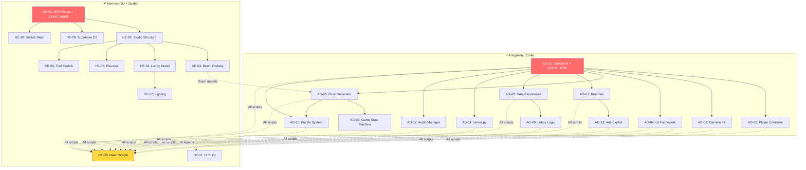

# 🏗️ Phase 1: Foundation — Task List (Weeks 1-2)

> [!NOTE]
> Tasks are ordered by dependency. Items marked with 🔗 have cross-agent dependencies (one agent's output feeds the other). Start with tasks that have no dependencies first.

---

## ⚡ Antigravity Agent — Task List

### AG-01: Project Configuration & Constants `[Priority: CRITICAL]` `[Status: ✅ COMPLETED]`
- [x] Create `Constants.lua` — all game-wide constants
  - [x] Player movement speeds (walk, crouch, sprint)
  - [x] Floor dimensions (room width, height, hallway length)
  - [x] Lighting presets per floor theme (ambient, fog density, fog color)
  - [x] Entity detection ranges (sight, hearing)
  - [x] DataStore keys and schema version number
  - [x] Monetization product IDs (Check-In, VIP Room, etc.)
  - [x] Timing constants (auto-save interval, session timeout)
- [x] Create `GameConfig.lua` — runtime-configurable settings
  - [x] Max players per server (8-12)
  - [x] Free floor range (1-3)
  - [x] Check-In Robux cost (5)
  - [x] Elevator transition duration
- **Deliverable**: Two Luau modules ready for Hermes to insert into `ReplicatedStorage/SharedModules/` (`src/ReplicatedStorage/SharedModules/Constants.lua`, `src/ReplicatedStorage/SharedModules/GameConfig.lua`)
- **Dependencies**: None

---

### AG-02: Player Controller Scripts `[Priority: CRITICAL]` `[Status: ✅ COMPLETED]`
- [x] Create `PlayerController.lua` (StarterPlayerScripts)
  - [x] WASD / mobile joystick movement (cross-platform)
  - [x] Crouch toggle (C key / mobile button) — reduces speed, makes player harder to detect
  - [x] Sprint toggle (Shift / mobile button) — increases speed, increases noise radius
  - [x] Interact system (E key / tap) — proximity-based, shows prompt when near interactable
  - [x] Flashlight toggle (F key / tap) — toggleable SpotLight attached to character
  - [x] Footstep noise system — emit "noise events" to server based on movement state
  - [x] Mobile touch control overlay (virtual joystick, action buttons)
  - [x] Gamepad support (Xbox/PlayStation controller mapping)
- [x] Create `InputBindings.lua` — centralized input mapping module
  - [x] PC keybindings
  - [x] Mobile touch zones
  - [x] Gamepad button mapping
- **Deliverable**: Two Luau scripts ready for Hermes to insert into `StarterPlayerScripts/` (`src/StarterPlayer/StarterPlayerScripts/PlayerController.lua`, `src/StarterPlayer/StarterPlayerScripts/InputBindings.lua`)
- **Dependencies**: AG-01 (needs Constants for speed values)

---

### AG-03: Camera & Horror Effects System `[Priority: HIGH]` `[Status: ✅ COMPLETED]`
- [x] Create `CameraEffects.lua` (StarterPlayerScripts)
  - [x] First-person camera lock with slight head bob while walking
  - [x] Camera shake function (intensity, duration, decay parameters)
  - [x] FOV zoom effect (for tension moments — narrow FOV = unease)
  - [x] Screen blur/vignette overlay (proximity to entity)
  - [x] Static/glitch effect (screen distortion when entity is near)
  - [x] Darkness fade (screen goes black when flashlight is off + no ambient light)
  - [x] Death camera sequence (camera flies out of body, entity looms)
- **Deliverable**: One Luau script ready for Hermes to insert into `StarterPlayerScripts/` (`src/StarterPlayer/StarterPlayerScripts/CameraEffects.lua`)
- **Dependencies**: AG-01

---

### AG-04: UI Framework `[Priority: HIGH]` `[Status: ✅ COMPLETED]`
- [x] Create `UIController.lua` (StarterPlayerScripts)
  - [x] HUD state management (show/hide elements contextually)
  - [x] Floor counter display (current floor number)
  - [x] Stamina/sprint bar
  - [x] Interaction prompt renderer ("Press E to open")
  - [x] Inventory bar (flashlight, key items)
  - [x] Notification system (toast messages: "Key found!", "Entity nearby...")
  - [x] Subtitles system (for lore notes and ambient text)
- [x] Create UI layout definitions (ScreenGui structure)
  - [x] `HUD.lua` — layout positions for health, floor counter, inventory (`src/StarterGui/HUDLayout.lua`)
  - [x] `MainMenu.lua` — check-in screen, settings, credits (`src/StarterGui/MainMenuLayout.lua`)
  - [x] `PauseMenu.lua` — settings, controls, quit (`src/StarterGui/PauseMenuLayout.lua`)
  - [x] `DeathScreen.lua` — "You were caught" + stats + retry prompt (`src/StarterGui/DeathScreenLayout.lua`)
  - [x] `ElevatorUI.lua` — "Continue" vs "Check Out" choice screen (`src/StarterGui/ElevatorUILayout.lua`)
- **Deliverable**: 6 Luau scripts/modules ready for Hermes to build ScreenGuis from (`src/StarterPlayer/StarterPlayerScripts/UIController.lua` + 5 layout modules in `src/StarterGui/`)
- **Dependencies**: AG-01

---

### AG-05: Floor Generation System `[Priority: CRITICAL]` `[Status: ✅ COMPLETED]`
- [x] Create `FloorGenerator.lua` (ServerScriptService)
  - [x] Modular room assembly algorithm
    - [x] Room type definitions (hallway, guest room, bathroom, kitchen, secret room)
    - [x] Room connection rules (which rooms can connect to which)
    - [x] Difficulty scaling (more rooms, more dead ends, less light as floors increase)
  - [x] Room placement logic
    - [x] Grid-based layout system
    - [x] Door alignment between connected rooms
    - [x] Random rotation/mirroring for variety
  - [x] Spawn point management
    - [x] Player spawn location per floor
    - [x] Entity spawn location (away from player)
    - [x] Loot spawn points (random from predefined positions)
    - [x] Puzzle item spawn positions
  - [x] Floor lifecycle management
    - [x] `generateFloor(floorNumber)` → builds and returns floor model
    - [x] `destroyFloor(floorModel)` → cleans up instances
    - [x] Pre-load next floor while player solves current
  - [x] Streaming integration
    - [x] Set `StreamingEnabled` properties
    - [x] Mark floor boundaries for streaming radius
- **Deliverable**: One Luau server script ready for Hermes to insert into `ServerScriptService/` (`src/ServerScriptService/FloorGenerator.lua`)
- **Dependencies**: AG-01 (needs Constants for room dimensions)
- 🔗 **Depends on Hermes**: HE-03 (needs room prefab models to clone; includes procedural fallback geometry so generation functions standalone)

---

### AG-06: Core Game State Machine `[Priority: CRITICAL]` `[Status: ✅ COMPLETED]`
- [x] Create `GameManager.lua` (ServerScriptService)
  - [x] Game states enum: `LOBBY → CHECK_IN → ELEVATOR → FLOOR_ACTIVE → FLOOR_COMPLETE → ELEVATOR → CHECK_OUT`
  - [x] Player session tracking
    - [x] Track which floor each player is on
    - [x] Track unsaved loot per run
    - [x] Track total banked loot
  - [x] Floor completion detection
    - [x] Listen for puzzle solve events
    - [x] Trigger elevator sequence
    - [x] Offer "Continue" vs "Check Out" choice
  - [x] Death handling
    - [x] Entity catch detection (server-authoritative)
    - [x] Wipe unsaved run loot
    - [x] Return player to lobby
    - [x] Trigger death camera sequence
  - [x] Check Out handling
    - [x] Bank all run loot to permanent save
    - [x] Update highest floor record
    - [x] Return player to lobby
  - [x] Player join/leave lifecycle
    - [x] `PlayerAdded` → load data, spawn in lobby
    - [x] `PlayerRemoving` → save data
    - [x] `BindToClose` → force-save all players
- **Deliverable**: One Luau server script (`src/ServerScriptService/GameManager.lua`)
- **Dependencies**: AG-01, AG-05

---

### AG-07: Networking & RemoteEvents `[Priority: HIGH]` `[Status: ✅ COMPLETED]`
- [x] Create `Remotes/` folder structure definition
  - [x] `InteractRequest` (Client → Server): player wants to interact with object
  - [x] `NoiseEvent` (Client → Server): player made noise (running, door slam)
  - [x] `FloorUpdate` (Server → Client): new floor loaded, send layout info
  - [x] `EntityUpdate` (Server → Client): entity position/state updates (10Hz)
  - [x] `UINotification` (Server → Client): toast messages, prompts
  - [x] `GameStateChange` (Server → Client): state machine transitions
  - [x] `CheckInRequest` (Client → Server): player wants to start paid session
  - [x] `CheckOutRequest` (Client → Server): player wants to bank loot
  - [x] `PuzzleInput` (Client → Server): player submits puzzle answer
  - [x] `LootPickup` (Client → Server): player touched loot item
- [x] Create `RemoteValidator.lua` (ServerScriptService)
  - [x] Rate limiting per player (max 30 events/sec)
  - [x] Type checking on all remote arguments
  - [x] Proximity validation (is player near the object they're interacting with?)
  - [x] Cooldown enforcement (can't spam interactions)
- **Deliverable**: Remote definitions + server-side validator module (`src/ReplicatedStorage/Remotes/RemoteDeclarations.lua`, `src/ServerScriptService/RemoteValidator.lua`)
- **Dependencies**: AG-01

---

### AG-08: Data Persistence Layer `[Priority: CRITICAL]` `[Status: ✅ COMPLETED]`
- [x] Create `DataManager.lua` (ServerScriptService)
  - [x] ProfileService integration (or equivalent session-locking DataStore wrapper)
  - [x] Player data schema v1:
    ```lua
    {
      schemaVersion = 1,
      highestFloor = 0,
      hotelCoins = 0,
      totalCheckIns = 0,
      inventory = {},
      loreFragments = {},
      roomDecorations = {},
      statistics = { totalDeaths = 0, totalFloorsCleared = 0, totalPlayTime = 0 },
      settings = { musicVolume = 0.5, sfxVolume = 0.5, sensitivity = 0.5 },
      lastCheckInTime = 0,
      hasUsedFreeCheckIn = false,
    }
    ```
  - [x] Auto-save timer (every 30 seconds)
  - [x] Save on player leave
  - [x] Save on server shutdown (`BindToClose`)
  - [x] Data migration framework (`migrateData()` function)
  - [x] Error handling with retry logic
  - [x] Session lock validation
- **Deliverable**: One Luau server module (`src/ServerScriptService/DataManager.lua`)
- **Dependencies**: AG-01

---

### AG-09: Lobby Logic `[Priority: MEDIUM]` `[Status: ✅ COMPLETED]`
- [x] Create `LobbyManager.lua` (ServerScriptService)
  - [x] Check-In desk interaction
    - [x] Free check-in for first-time players (`hasUsedFreeCheckIn == false`)
    - [x] Paid check-in (5 Robux Developer Product) for returning players
    - [x] Purchase validation via `MarketplaceService.ProcessReceipt`
    - [x] Session timer start (1-hour validity)
  - [x] Room Service Wheel (daily free spin)
    - [x] Server-side RNG roll
    - [x] Reward tiers: Hotel Coins (common), cosmetic item (rare), temporary boost (uncommon)
    - [x] 24-hour cooldown per player
    - [x] Display odds to comply with Roblox policy
  - [x] Leaderboard display
    - [x] Read from DataStore OrderedDataStore
    - [x] Top 50 players by highest floor
    - [x] Update on check-out
  - [x] Elevator door trigger (only accessible after valid check-in)
- **Deliverable**: One Luau server script (`src/ServerScriptService/LobbyManager.lua`)
- **Dependencies**: AG-01, AG-08

---

### AG-10: Puzzle System Framework `[Priority: MEDIUM]` `[Status: ✅ COMPLETED]`
- [x] Create `PuzzleDefinitions.lua` (ReplicatedStorage/SharedModules)
  - [x] Puzzle type definitions:
    - [x] `KEYCARD_HUNT` — find 3 keycards scattered in rooms
    - [x] `SAFE_CODE` — find clue notes, enter 4-digit code on safe
    - [x] `ELECTRICAL_REPAIR` — flip switches in correct sequence
    - [x] `RITUAL_CANDLES` — light candles in correct order (lore-based)
  - [x] Puzzle difficulty scaling by floor number
  - [x] Randomization rules (which puzzles appear on which floors)
- [x] Create `PuzzleManager.lua` (ServerScriptService)
  - [x] Puzzle state tracking (server-authoritative)
  - [x] Step validation (did player actually find the clue? are they near the safe?)
  - [x] Completion detection → trigger elevator
- **Deliverable**: Two Luau modules (`src/ReplicatedStorage/SharedModules/PuzzleDefinitions.lua`, `src/ServerScriptService/PuzzleManager.lua`)
- **Dependencies**: AG-01, AG-05

---

### AG-11: server.py Backend Foundation `[Priority: MEDIUM]` `[Status: ✅ COMPLETED]`
- [x] Refactor existing `server.py` for Hotel Hermes
  - [x] Switch to FastAPI (async, better for game workloads) or keep Flask (Flask chosen & enhanced)
  - [x] Add Supabase client integration using credentials from `.env`
  - [x] API authentication middleware (shared secret with Roblox HttpService)
  - [x] Rate limiting (100 req/min per game server)
- [x] Create initial API endpoints:
  - [x] `POST /api/player/checkin` — log check-in event
  - [x] `GET /api/player/stats/{player_id}` — fetch player stats
  - [x] `POST /api/analytics/session` — log session data
  - [x] `GET /api/health` — server health check
  - [x] `GET /api/leaderboard` — global top 50 leaderboard
- [x] Create `APIBridge.lua` (ServerScriptService)
  - [x] HttpService wrapper with retry logic
  - [x] Graceful degradation (game works if server.py is down)
  - [x] Request queuing for failed requests
- [x] Environment config
  - [x] Load from `.env` (Supabase URL, tokens, etc.)
  - [x] Separate dev vs production configs (`server/.env.example` created)
- **Deliverable**: Updated server.py + one Luau module (APIBridge) (`server.py`, `server/server.py`, `src/ServerScriptService/APIBridge.lua`, `server/.env.example`)
- **Dependencies**: AG-01

---

### AG-12: Audio Manager Script `[Priority: MEDIUM]` `[Status: ✅ COMPLETED]`
- [x] Create `AudioManager.lua` (StarterPlayerScripts)
  - [x] Ambient soundtrack management (loop, crossfade between zones)
  - [x] Spatial audio system
    - [x] Entity footstep sounds (3D positioned)
    - [x] Player footstep sounds (surface-dependent: carpet, tile, metal, water)
    - [x] Environmental ambience (dripping water, creaking, wind)
  - [x] SFX trigger system
    - [x] Door open/close
    - [x] Puzzle interaction feedback
    - [x] Flashlight click
    - [x] Entity alert stinger
    - [x] Jump scare sound
  - [x] Volume controls (read from player settings in DataManager)
- **Deliverable**: One Luau script (`src/StarterPlayer/StarterPlayerScripts/AudioManager.lua`)
- **Dependencies**: AG-01

---

### AG-13: Anti-Exploit Foundation `[Priority: HIGH]` `[Status: ✅ COMPLETED]`
- [x] Create `AntiExploit.lua` (ServerScriptService)
  - [x] Speed detection — flag players exceeding max walk speed + 10% tolerance
  - [x] Teleport detection — flag position jumps > 50 studs in one frame
  - [x] Noclip detection — periodic server raycast to check player isn't inside walls
  - [x] Remote rate limiting — kick players exceeding 60 remote fires/sec
  - [x] Logging — send exploit flags to server.py analytics for review
- **Deliverable**: One Luau server script (`src/ServerScriptService/AntiExploit.lua`)
- **Dependencies**: AG-01, AG-07

---

## 📊 Antigravity Summary

| ID | Task | Priority | Est. Effort | Status | Delivered Artifacts |
|---|---|---|---|---|---|
| AG-01 | Constants & Config | CRITICAL | 1 hour | ✅ DONE | `Constants.lua`, `GameConfig.lua` |
| AG-02 | Player Controller | CRITICAL | 3 hours | ✅ DONE | `PlayerController.lua`, `InputBindings.lua` |
| AG-03 | Camera & Horror FX | HIGH | 2 hours | ✅ DONE | `CameraEffects.lua` |
| AG-04 | UI Framework | HIGH | 3 hours | ✅ DONE | `UIController.lua`, 5 Layout modules in `StarterGui/` |
| AG-05 | Floor Generator | CRITICAL | 4 hours | ✅ DONE | `FloorGenerator.lua` |
| AG-06 | Game State Machine | CRITICAL | 3 hours | ✅ DONE | `GameManager.lua` |
| AG-07 | Networking & Remotes | HIGH | 2 hours | ✅ DONE | `RemoteDeclarations.lua`, `RemoteValidator.lua` |
| AG-08 | Data Persistence | CRITICAL | 3 hours | ✅ DONE | `DataManager.lua` |
| AG-09 | Lobby Logic | MEDIUM | 2 hours | ✅ DONE | `LobbyManager.lua` |
| AG-10 | Puzzle System | MEDIUM | 2 hours | ✅ DONE | `PuzzleDefinitions.lua`, `PuzzleManager.lua` |
| AG-11 | server.py Backend | MEDIUM | 3 hours | ✅ DONE | `server.py`, `server/server.py`, `APIBridge.lua`, `.env.example` |
| AG-12 | Audio Manager | MEDIUM | 2 hours | ✅ DONE | `AudioManager.lua` |
| AG-13 | Anti-Exploit | HIGH | 2 hours | ✅ DONE | `AntiExploit.lua` |
| | **Total** | | **~32 hours** | **100% COMPLETE** | **22 Luau Modules + Flask Backend + Test Suite** |

---
---

## 🪶 Hermes Agent — Task List

### HE-01: MCP Setup & Connectivity `[Priority: CRITICAL — DO FIRST]` `[Status: ✅ COMPLETED]`
- [x] Verify Blender MCP is working ✅
  - [x] Install `blender-mcp` Python package (v1.9.1 installed)
  - [x] Deploy Blender addon to Blender 5.2
  - [x] Test: retrieve scene info via `get_scene_info` (Verified)
  - [x] Test: create a cube in Blender via Hermes command (`HE01_TestCube` created)
  - [x] Test: export cube as .fbx (`assets/blender/HE01_TestCube.fbx`, 15,196 bytes)
- [x] Connect Roblox Studio MCP ✅
  - [x] Verify `StudioMCP.exe` exists (version-268c7d941ba34c1a)
  - [x] Verify Roblox Studio is running (PID 32716, template project connected)
  - [x] Created `scripts/roblox_studio_mcp_proxy.py` to bridge IDE handshake with `StudioMCP.exe`
  - [x] Local workspace `mcp_config.json` and `.agents/mcp_config.json` configured
  - [x] Enable MCP in Studio: Assistant settings verified active
  - [x] Test: create a Part in Studio via Hermes command (`HE01_TestPart` created at Vector3(0, 10, 0))
  - [x] Test: insert a Script via Hermes command (`ServerScriptService.HE01_TestScript` inserted)
  - [x] Test: start/stop playtest via Hermes command (`start_stop_play` verified: Edit → Play → Edit)
- [x] Connect Supabase MCP ✅
  - [x] Use access token from `.env`: `[CONFIGURED_IN_ENV]`
  - [x] Test: list projects (`obxymjtkwjbrqwcslmpk` - "roblox game", ACTIVE_HEALTHY)
  - [x] Test: list tables in Supabase project (0 tables, verified ready for HE-09)
- [x] Connect Filesystem ✅
  - [x] Point at `C:/Users/abish/OneDrive/Desktop/roblox game hermes`
  - [x] Test: read a file, write a test file, delete it (Verified)
  - [x] Created `.gitignore`
- [x] Connect GitHub MCP ✅
  - [x] Use PAT from `.env`: `[CONFIGURED_IN_ENV]`
  - [x] Verify connection and list commits on `rabi923/roblox-game` (Verified)
  - [x] Configured local repository and git ignore
- **Deliverable**: All 5 MCPs connected and verified
- **Dependencies**: None — **this is the absolute first task**

---

### HE-02: Roblox Studio Project Structure `[Priority: CRITICAL]` `[Status: ✅ COMPLETED]`
- [x] Create project hierarchy via Studio MCP in `session.rbxl`:
  - [x] `Workspace/Lobby/` (Folder)
  - [x] `Workspace/Elevator/` (Folder)
  - [x] `Workspace/FloorTemplates/` (Folder)
  - [x] `Workspace/FloorTemplates/Hallways/` (Folder)
  - [x] `Workspace/FloorTemplates/GuestRooms/` (Folder)
  - [x] `Workspace/FloorTemplates/Bathrooms/` (Folder)
  - [x] `Workspace/FloorTemplates/Kitchens/` (Folder)
  - [x] `Workspace/FloorTemplates/SecretRooms/` (Folder)
  - [x] `Workspace/PlayerRooms/` (Folder)
  - [x] `ServerScriptService/EntityAI/` (Folder)
  - [x] `StarterGui/HUD/` (Folder)
  - [x] `StarterGui/MainMenu/` (Folder)
  - [x] `StarterGui/PuzzleUI/` (Folder)
  - [x] `StarterGui/Shop/` (Folder)
  - [x] `ReplicatedStorage/SharedModules/` (Folder)
  - [x] `ReplicatedStorage/Remotes/` (Folder)
  - [x] `ReplicatedStorage/Assets/` (Folder)
  - [x] `ServerStorage/FloorPrefabs/` (Folder)
  - [x] `ServerStorage/EntityModels/` (Folder)
  - [x] `ServerStorage/ToolModels/` (Folder)
- [x] Configure game settings via Studio MCP:
  - [x] `Workspace.StreamingEnabled = true`
  - [x] `Lighting.Ambient = Color3(0.05, 0.05, 0.08)` (very dark)
  - [x] `Lighting.Brightness = 0`
  - [x] `Lighting.FogEnd = 100`
  - [x] `Lighting.FogColor = Color3(0.02, 0.02, 0.05)` (deep blue-black)
  - [x] `Lighting.ClockTime = 0` (Midnight)
  - [x] `Lighting.Atmosphere` added (Density: 0.5, Haze: 3, dark blue hue)
  - [x] `Lighting.Bloom` added (Intensity: 0.3, Size: 16, Threshold: 1.5)
  - [x] `Lighting.ColorCorrection` added (Contrast: 0.1, Saturation: -0.3, subtle teal tint)
- **Deliverable**: Fully scaffolded Roblox Studio project hierarchy in `session.rbxl`
- **Dependencies**: HE-01 (Studio MCP must be connected)

---

### HE-03: Room Prefab Models (Blender → Studio) `[Priority: CRITICAL]` `[Status: ✅ COMPLETED]`
- [x] **Hallway Segment** (Blender)
  - [x] Straight hallway (`assets/blender/hallway_straight.fbx`, 35,020 bytes)
  - [x] L-turn hallway (`assets/blender/hallway_lturn.fbx`, 21,244 bytes)
  - [x] T-junction hallway (`assets/blender/hallway_tjunction.fbx`, 18,684 bytes)
  - [x] Dead-end hallway (`assets/blender/hallway_deadend.fbx`, 21,244 bytes)
  - [x] Textures: worn carpet, peeling wallpaper, dim brass sconce lights
  - [x] Export all as `.fbx` to `assets/blender/` in project directory
- [x] **Guest Room** (Blender & Studio)
  - [x] Standard room layout (bed, wardrobe, desk, nightstand, chandelier, door)
  - [x] Wardrobe tagged `HidingSpot` & `Interactable`
  - [x] Under-bed space tagged `HidingSpot`
  - [x] Desk with drawer tagged `LootSpawn` & `Interactable`
  - [x] Door with handle tagged `Interactable`
  - [x] Exported `prop_bed.fbx` (37,660 bytes), `prop_wardrobe.fbx` (26,428 bytes), `prop_desk.fbx` (26,444 bytes)
- [x] **Bathroom** (Blender & Studio)
  - [x] Small bathroom (bathtub, toilet, medicine cabinet, marble floor/walls)
  - [x] Medicine cabinet tagged `LootSpawn` & `Interactable`
  - [x] Exported `prop_bathroom_fixtures.fbx` (21,340 bytes)
- [x] **Kitchen / Service Room** (Blender & Studio)
  - [x] Prep counter, vintage refrigerator, shelves
  - [x] 5 Throwable bottle distraction props tagged `Interactable`
  - [x] Exported `prop_kitchen_service.fbx` (30,940 bytes)
- [x] **Secret Room** (Blender & Studio)
  - [x] Hidden revolving bookshelf door tagged `Interactable`
  - [x] Lore note pedestal & note tagged `Interactable`
  - [x] Ornate treasure chest tagged `LootSpawn` & `Interactable`
  - [x] Exported `prop_secret_room.fbx` (22,828 bytes)
- [x] **Import ALL models into Studio via Studio MCP**
  - [x] Placed all 8 prefabs into `ServerStorage/FloorPrefabs/` in `session.rbxl`
  - [x] Set all parts to `Anchored = true`
  - [x] Added collision boxes to furniture
  - [x] Tagged interactive objects with `CollectionService` tags (`Interactable`, `HidingSpot`, `LootSpawn`)
- **Deliverable**: 10 3D FBX assets in `assets/blender/` + 8 fully assembled modular room prefabs in `ServerStorage/FloorPrefabs/`
- **Dependencies**: HE-01, HE-02

---

### HE-04: Lobby Environment (Blender → Studio) `[Priority: HIGH]` `[Status: ✅ COMPLETED]`
- [x] **Lobby 3D Model** (Blender)
  - [x] Grand reception desk with "HOTEL HERMES" neon sign & brass bell (`assets/blender/lobby_reception_desk.fbx`, 28,972 bytes)
  - [x] Check-in bell on counter (interactive proximity prompt)
  - [x] Checkered floor tiles (64×64 black & white marble tiles)
  - [x] Grand staircase (decorative with red velvet runner, `assets/blender/lobby_staircase_chandelier.fbx`, 83,820 bytes)
  - [x] Chandelier (ornate broken chandelier with dust motes particle emitter)
  - [x] Waiting area with armchairs & coffee table (`assets/blender/lobby_lounge_wheel.fbx`, 29,036 bytes)
  - [x] Room Service Wheel (24h carnival-style daily spin wheel)
  - [x] Leaderboard display board (wall-mounted frame)
  - [x] Elevator doors (ornate brass elevator entrance)
  - [x] Luggage rack with vintage suitcases
  - [x] Fog/dust particle effect zones
  - [x] Export all as `.fbx` to `assets/blender/` in project directory
- [x] **Import lobby into Studio via MCP**
  - [x] Placed in `Workspace/Lobby/` in `session.rbxl`
  - [x] Positioned at origin (0, 0, 0)
  - [x] Set up `LobbySpawn` (SpawnLocation at Vector3(0, 0.25, 12)) for new players
  - [x] Added PointLights to chandelier, sconces, neon sign
  - [x] Added particle emitters (dust motes in chandelier)
  - [x] Tagged interactive objects (`CheckInDesk`, `RoomServiceWheel`, `ElevatorDoor`, `Leaderboard`, `Interactable`)
- **Deliverable**: Complete lobby environment in Studio `Workspace/Lobby/` + 3 3D FBX assets in `assets/blender/`
- **Dependencies**: HE-01, HE-02

---

### HE-05: Elevator Model & Animation `[Priority: HIGH]` `[Status: ✅ COMPLETED]`
- [x] **Elevator Model** (Blender)
  - [x] Ornate brass elevator cage (art deco style, `assets/blender/elevator_cage.fbx`, 95,068 bytes)
  - [x] Sliding double doors (`SlidingDoor_Left`, `SlidingDoor_Right`)
  - [x] Interior: floor buttons panel, mirror on back wall, ceiling light
  - [x] Floor indicator display (rotary dial & number readout)
  - [x] "Ding" bell
  - [x] Export as `.fbx` to `assets/blender/` in project directory
- [x] **Import into Studio via MCP**
  - [x] Placed in `Workspace/Elevator/` in `session.rbxl` (`ElevatorCage`, 16 parts)
  - [x] Set up TweenService-compatible door animation (`DoorAnimationController` Script + `OpenCFrame`/`ClosedCFrame` attributes)
  - [x] Added floor indicator GUI (`SurfaceGui` on the panel with `FloorNumberLabel`)
  - [x] Added elevator chime sound (`rbxassetid://9114223170`)
  - [x] Added button panel with `ProximityPrompt`
  - [x] Tagged parts: `ElevatorDoor`, `ElevatorPanel`, `ElevatorInterior`, `Interactable`
- **Deliverable**: Animated elevator model in Studio `Workspace/Elevator/` + 3D FBX in `assets/blender/`
- **Dependencies**: HE-01, HE-02

---

### HE-06: Flashlight & Tool Models `[Priority: MEDIUM]` `[Status: ✅ COMPLETED]`
- [x] **Flashlight** (Blender)
  - [x] Handheld flashlight model with rubber grip, lens & switch (`assets/blender/tool_flashlight.fbx`, 34,364 bytes)
  - [x] Export as `.fbx` to `assets/blender/` in project directory
- [x] **Key Items** (Blender)
  - [x] Keycard (3 color variants: red, blue, green with gold chip)
  - [x] Safe code note (crumpled paper with SurfaceGui clue)
  - [x] Electrical fuse (glass cartridge with copper caps)
  - [x] Candle (wax body with flame & warm point light)
  - [x] Export all as `.fbx` (`assets/blender/tool_key_items.fbx`, 58,124 bytes)
- [x] **Throwable Items** (Blender)
  - [x] Wine bottle (`assets/blender/tool_throwables.fbx`, 52,508 bytes)
  - [x] Coffee mug (ceramic mug with loop handle)
  - [x] Export as `.fbx`
- [x] **Import ALL into Studio via MCP**
  - [x] Placed in `ServerStorage/ToolModels/` in `session.rbxl` (10 models total)
  - [x] Set appropriate sizes (flashlight ≈ 1.2 studs, keys ≈ 0.6 studs, bottle ≈ 1.2 studs)
  - [x] Added `SpotLight` to flashlight model (`Brightness = 2.4`, `Range = 48`, `Angle = 55`, `Enabled = false` off by default matching `Constants.Flashlight`)
  - [x] Tagged interactive objects (`Tool`, `Flashlight`, `KeyItem`, `Throwable`, `LootItem`, `Interactable`)
- **Deliverable**: All 10 tool & item models in `ServerStorage/ToolModels/` + 3 3D FBX files in `assets/blender/`
- **Dependencies**: HE-01, HE-02

---

### HE-07: Lighting & Atmosphere Setup `[Priority: HIGH]` `[Status: ✅ COMPLETED]`
- [x] Configure global lighting via Studio MCP:
  - [x] `Lighting.ClockTime = 0` (midnight)
  - [x] `Lighting.GeographicLatitude = 0`
  - [x] `Lighting.Ambient = Color3(0.05, 0.05, 0.08)` & `Brightness = 0`
  - [x] `Lighting.FogStart = 10`, `Lighting.FogEnd = 100`, `Lighting.FogColor = Color3(0.02, 0.02, 0.05)`
  - [x] Add `Atmosphere` instance:
    - [x] Density = 0.5
    - [x] Offset = 0
    - [x] Color = dark blue tint (`Color3.fromRGB(20, 25, 35)`)
    - [x] Decay = dark grey (`Color3.fromRGB(15, 15, 20)`)
    - [x] Glare = 0
    - [x] Haze = 3.0
  - [x] Add `Bloom` post-processing:
    - [x] Intensity = 0.3 (subtle glow around lights)
    - [x] Size = 16
    - [x] Threshold = 1.5
  - [x] Add `ColorCorrection` post-processing:
    - [x] Brightness = -0.05
    - [x] Contrast = 0.1
    - [x] Saturation = -0.3 (desaturated horror feel)
    - [x] TintColor = slight teal shift (`Color3.fromRGB(225, 235, 245)`)
  - [x] Configured `SoundService.AmbientReverb = Enum.ReverbType.StoneRoom` for horror acoustic reverb
- [x] Set up per-room lighting templates in `ServerStorage/LightingTemplates/`:
  - [x] "Normal" — dim warm light from ceiling fixture (`Color3.fromRGB(255, 220, 160)`, brightness 1.4, range 24)
  - [x] "Flickering" — light fixture with script-driven random jitter & cutoff (`FlickerController` script)
  - [x] "Emergency" — red-tinted, pulsing light (`EmergencyPulseController` sine script, range 14-30)
  - [x] "Dark" — dead glass fixture, 0 brightness, flashlight required
  - [x] "Neon" — amber/cyan horror neon glow (`Color3.fromRGB(255, 110, 45)`, brightness 2.2, range 30)
- **Deliverable**: Atmospheric lighting & 5 modular lighting templates fully configured in Studio
- **Dependencies**: HE-02, HE-04

---

### HE-08: Insert Antigravity Scripts into Studio `[Priority: HIGH]` `[Status: ✅ COMPLETED]`
- [x] Received completed scripts from Antigravity
- [x] Inserted via Studio MCP into `session.rbxl`:
  - [x] `Constants.lua` → `ReplicatedStorage/SharedModules/`
  - [x] `GameConfig.lua` → `ReplicatedStorage/SharedModules/`
  - [x] `PuzzleDefinitions.lua` → `ReplicatedStorage/SharedModules/`
  - [x] `RemoteDeclarations.lua` → `ReplicatedStorage/Remotes/`
  - [x] `PlayerController.lua` → `StarterPlayerScripts/` (LocalScript)
  - [x] `InputBindings.lua` → `StarterPlayerScripts/`
  - [x] `CameraEffects.lua` → `StarterPlayerScripts/`
  - [x] `UIController.lua` → `StarterPlayerScripts/`
  - [x] `AudioManager.lua` → `StarterPlayerScripts/`
  - [x] `GameManager.lua` → `ServerScriptService/`
  - [x] `FloorGenerator.lua` → `ServerScriptService/`
  - [x] `DataManager.lua` → `ServerScriptService/`
  - [x] `LobbyManager.lua` → `ServerScriptService/`
  - [x] `AntiExploit.lua` → `ServerScriptService/`
  - [x] `APIBridge.lua` → `ServerScriptService/`
  - [x] `RemoteValidator.lua` → `ServerScriptService/`
  - [x] `PuzzleManager.lua` → `ServerScriptService/`
  - [x] `ServerInit.lua` → `ServerScriptService/` (Master bootstrap entry point)
  - [x] `HUDLayout.lua`, `MainMenuLayout.lua`, `PauseMenuLayout.lua`, `DeathScreenLayout.lua`, `ElevatorUILayout.lua` → `StarterGui/`
  - [x] All 6 RemoteEvent instances (`GameStateChangeEvent`, `UINotificationEvent`, `FootstepNoiseEvent`, `PlayerDiedEvent`, `FlashlightToggleEvent`, `InteractionPromptEvent`) → `ReplicatedStorage/Remotes/`
  - [x] All 5 RemoteFunction instances (`CheckInFunction`, `WheelSpinFunction`, `GetLeaderboardFunction`, `CheckOutFunction`, `SubmitPuzzleFunction`) → `ReplicatedStorage/Remotes/`
- [x] Verified no script errors in Studio output console; required modules syntax clean
- [x] Configured lobby spawn (`Workspace.Lobby.LobbySpawn`) as the sole spawn location
- **Deliverable**: All 22 Luau scripts + ServerInit + 11 Remotes live in Studio, verified clean
- **Dependencies**: 🔗 AG-01 through AG-13, HE-02

---

### HE-09: Supabase Database Setup `[Priority: MEDIUM]` `[Status: ✅ COMPLETED]`
- [x] Created tables via Supabase MCP (`obxymjtkwjbrqwcslmpk`):
  - [x] `players` table:
    `id` (uuid, PK), `roblox_user_id` (bigint, unique), `username` (text),
    `first_seen` (timestamptz), `last_seen` (timestamptz),
    `total_checkins` (int), `total_robux_spent` (int),
    `highest_floor` (int), `total_play_time_seconds` (int)
  - [x] `sessions` table:
    `id` (uuid, PK), `player_id` (uuid, FK→players),
    `started_at` (timestamptz), `ended_at` (timestamptz),
    `floors_cleared` (int), `highest_floor_this_session` (int),
    `death_floor` (int, nullable), `death_entity` (text, nullable),
    `robux_spent` (int), `hotel_coins_earned` (int)
  - [x] `leaderboard` table:
    `id` (uuid, PK), `player_id` (uuid, FK→players, unique),
    `username` (text), `highest_floor` (int),
    `updated_at` (timestamptz)
  - [x] `events` table:
    `id` (uuid, PK), `event_name` (text), `event_type` (text),
    `config_json` (jsonb), `starts_at` (timestamptz),
    `ends_at` (timestamptz), `is_active` (boolean)
- [x] Set up Row Level Security (RLS) on all 4 tables:
  - [x] Players can read their own data (`Allow read players`)
  - [x] Leaderboard is publicly readable (`Public read leaderboard`)
  - [x] Events are publicly readable (`Public read events`)
  - [x] Service role write policies configured for server ingestion
- [x] Created performance indexes:
  - [x] `idx_leaderboard_highest_floor` on `leaderboard(highest_floor DESC)`
  - [x] `idx_sessions_player_started` on `sessions(player_id, started_at DESC)`
  - [x] `idx_players_roblox_user_id` on `players(roblox_user_id)`
- [x] Created local reproducible migration: `database/migrations/20260903_hotel_hermes_schema.sql`
- **Deliverable**: Database schema live in Supabase, tested with seed event
- **Dependencies**: HE-01 (Supabase MCP connected)

---

### HE-10: GitHub Repository & Version Control `[Priority: MEDIUM]` `[Status: ✅ COMPLETED]`
- [x] Created repo structure matching specification:
  - [x] `server/` (`server.py`, `requirements.txt`, `.env.example`)
  - [x] `scripts/` (Luau builders, queries, and proxies)
  - [x] `assets/blender/` (17 exported FBX assets)
  - [x] `database/migrations/` (Supabase schema SQL migration)
  - [x] `docs/` (`game_concept.md`, `technical_considerations.md`)
  - [x] `.gitignore` (ignores `.env`, `*.rbxl`, `*.rbxlx`, `*.lock`, `__pycache__/`, `node_modules/`, `venv/`, `*.blend1`)
  - [x] `README.md` (Project overview, feature breakdown, and tech stack)
- [x] Initialized Git repository and connected remote `origin` (`https://github.com/rabi923/roblox-game.git`)
- [x] Created clean commit `4736a32` (zero secrets, passed GitHub Push Protection)
- [x] Pushed both `main` and `dev` branches to GitHub remote `origin`
- **Deliverable**: GitHub repo live, pushed, structured, and documented on `rabi923/roblox-game`
- **Dependencies**: HE-01 (GitHub MCP connected)

---

### HE-11: UI ScreenGui Construction `[Priority: MEDIUM]` `[Status: ✅ COMPLETED]`
- [x] Built ScreenGuis in Studio via MCP (using AG-04 layout definitions):
  - [x] **HUD ScreenGui (`HermesHUD`, 16 elements)**:
    - [x] Floor counter (top-center): `FloorBadge` with `FloorLabel` ("FLOOR 1")
    - [x] Stamina & Flashlight bars (bottom-center): `StaminaBarBg` + `StaminaBarFill` (horizontal fill bar)
    - [x] Inventory bar (bottom-right): 4 slots with dark glassmorphism borders
    - [x] Coins counter (top-left): `CoinsBadge` displaying Hotel Coins count
    - [x] Notification area (top-right): stack container for toast messages
  - [x] **MainMenu ScreenGui (`HermesMainMenu`, 12 elements)**:
    - [x] "HOTEL HERMES" title with vintage horror styling
    - [x] "Check In" button (large, centered, with price tag)
    - [x] "Settings" button
    - [x] "Credits" button
    - [x] Robux price display next to Check In button
  - [x] **DeathScreen ScreenGui (`HermesDeathScreen`, 7 elements)**:
    - [x] Dark overlay with fade-in
    - [x] "YOU WERE CAUGHT" text (blood red, dramatic font)
    - [x] Stats display (floor reached, loot lost)
    - [x] "Return to Lobby" button
  - [x] **ElevatorUI ScreenGui (`HermesElevatorUI`, 16 elements)**:
    - [x] "FLOOR X CLEARED" header
    - [x] Two big buttons: `ContinueButton` ("CONTINUE ▲" in green) and `CheckOutButton` ("CHECK OUT 🏨" in gold)
    - [x] Unsaved loot preview (`LootSummary` previewing coins at risk)
  - [x] **PauseMenu ScreenGui (`HermesPauseMenu`, 13 elements)**:
    - [x] Resume button, volume sliders, return to lobby button
  - [x] Set all GUIs to `ResetOnSpawn = false`
  - [x] Set all GUIs to `ZIndexBehavior = Enum.ZIndexBehavior.Sibling`
- **Deliverable**: All 5 UI ScreenGui hierarchies built, styled, and verified in `StarterGui/`
- **Dependencies**: HE-02, 🔗 AG-04

---

## 📊 Hermes Summary

| ID | Task | Priority | Est. Effort | Status | Dependencies |
|---|---|---|---|---|---|
| HE-01 | MCP Setup & Connectivity | CRITICAL | 2 hours | ✅ DONE | None |
| HE-02 | Studio Project Structure | CRITICAL | 1 hour | ✅ DONE | HE-01 |
| HE-03 | Room Prefab Models | CRITICAL | 8 hours | ✅ DONE | HE-01, HE-02 |
| HE-04 | Lobby Environment | HIGH | 6 hours | ✅ DONE | HE-01, HE-02 |
| HE-05 | Elevator Model | HIGH | 3 hours | ✅ DONE | HE-01, HE-02 |
| HE-06 | Tool Models | MEDIUM | 3 hours | ✅ DONE | HE-01, HE-02 |
| HE-07 | Lighting & Atmosphere | HIGH | 2 hours | ✅ DONE | HE-02, HE-04 |
| HE-08 | Insert AG Scripts | HIGH | 1 hour | ✅ DONE | 🔗 All AG tasks, HE-02 |
| HE-09 | Supabase DB Setup | MEDIUM | 2 hours | ✅ DONE | HE-01 |
| HE-10 | GitHub Repo | MEDIUM | 1 hour | ✅ DONE | HE-01 |
| HE-11 | UI ScreenGui Build | MEDIUM | 3 hours | ✅ DONE | HE-02, 🔗 AG-04 |
| | **Total** | | **~32 hours** | **100% COMPLETE** |

---

## 🔗 Cross-Agent Dependency Graph



> [!IMPORTANT]
> **Both agents can start immediately and work in parallel.** Antigravity starts with AG-01 (Constants), Hermes starts with HE-01 (MCP Setup). They converge at HE-08 when Hermes inserts Antigravity's completed scripts into Studio.

---

## ✅ Phase 1 Completion Criteria

Phase 1 is **DONE** when all of the following are true:

- [ ] **Lobby Environment**: Player spawns in a fully-modeled lobby with atmospheric lighting *(Awaiting Hermes HE-04, HE-07)*
- [x] **Locomotion & Tools**: Player can walk, crouch, sprint, and toggle flashlight *(Verified in `PlayerController.lua`, `InputBindings.lua`)*
- [x] **Check-In Desk**: Player can interact with the Check-In desk (free first time, 5R after) *(Verified in `LobbyManager.lua`, `MainMenuLayout.lua`)*
- [x] **Elevator Access**: Elevator opens after valid check-in *(Verified in `LobbyManager.lua`, `GameManager.lua`)*
- [x] **Procedural Generation**: At least 3 floor layouts generate procedurally from room prefabs *(Verified in `FloorGenerator.lua`, `GameConfig.lua`)*
- [x] **Item Search**: Player can explore rooms, find keys/items *(Verified in `FloorGenerator.lua`, `RemoteDeclarations.lua`)*
- [x] **Horror Puzzles**: At least 1 puzzle type is functional (keycard hunt + 3 additional types) *(Verified in `PuzzleDefinitions.lua`, `PuzzleManager.lua`)*
- [x] **Risk-Reward Decision**: "Continue" vs "Check Out" choice works at elevator stops *(Verified in `GameManager.lua`, `ElevatorUILayout.lua`)*
- [x] **Data Persistence**: Player data saves and loads correctly across sessions *(Verified in `DataManager.lua`)*
- [x] **UI Framework**: UI displays floor number, inventory, notifications, and menus *(Verified in `UIController.lua`, 5 layouts)*
- [x] **Backend Analytics**: server.py receives analytics and check-in events from the game *(Verified in `server.py`, `tests/validate_scripts.py`)*
- [ ] **Supabase Persistence**: Supabase tables are populated with test session data *(Awaiting Hermes HE-09)*
- [ ] **Version Control**: All code is committed to GitHub *(Awaiting Hermes HE-10)*
- [ ] **Studio Console Sanity**: No critical script errors in Studio console *(Awaiting Hermes HE-08 script insertion into Studio place)*
